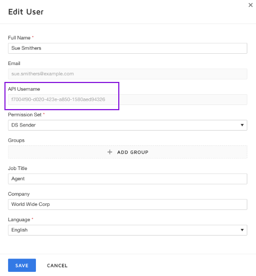
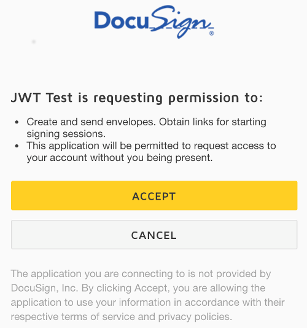

# OAuth_JWT_recipes
Recipes for Service Integration authentications via the OAuth JWT flow.

Php and command line examples are included in this repo.

## Information Security
Note! In the following sections we will be updating files to include
data that must be secured: your application's integration key, and
its private key. Safeguard this information appropriately!

## Service Integrations and the OAuth JWT flow
In normal operation, Service Integrations, by definition,
do not have a person available to login.

Instead, a service integration's authentication is granted permission
to act on behalf of a user account (a one time step).
It then operates autonomously.

The modern authentication technique for Service Integrations is
the OAuth JWT flow. The JWT flow uses public/private key encryption to
securely send an authenticated request to the DocuSign Authentication Server.

The authentication server responds with a limited lifetime access token. The token is used
with subsequent API calls.

After the token expires, a new token is requested by repeating the process.

The token usually represents a user in the DocuSign system. The user can
be an integration-specific "system user," a user configured to send the
application's envelopes.
Or the application can represent different users during its operation.

In either case, requesting a token for the app to act as a user is
called "impersonation." Impersonation is the OAuth standard term for the
DocuSign "SOBO" feature.

In the future, applications will also be able to request tokens to
represent the apps themselves.

### Configuring an Integration Key for the OAuth JWT flow

The app's integration key must have a public/private keypair configured:

1. Goto the DocuSign Administrator Tool (New DocuSign Signing Experience)
1. Open the INTEGRATIONS / API and Keys screen
1. Create a new Integration Key as follows:
   1. App Description: JWT Test
   1. Link to Privacy Policy: optional
   1. Link to Terms of Use: optional
   1. This is a mobile app: Do NOT check
   1. Redirect URIs: add `https://docusign.com` as a redirect uri.
      This is a placeholder uri, it will only be used when we
      ask users to authorize our application.
   1. RSA Keypairs: Click to create a keypair. Then copy the public and private keys to two
      different files in a secure directory. Store the Keypair ID too, you can use it to
      identify the keypair. Eg if you later want to delete a specific keypair.

### Creating the JWT token

Your application will create a JWT token, and then send it to DocuSign to
obtain an access token.

JWT tokens are standard. You should use a JWT token generation library
to create your JWT tokens. The JWT parameter names in the standard are
often used by the software libraries.

JWT tokens for DocuSign must use the following options and settings:

JWT Parameter | Description | DocuSign usage
------------- | ----------- | --------------
alg | Algorithm | DocuSign only uses the `RS256` algorithm.
iss | Issuer | client_id (Integration Key).
sub | Subject | The user's user_id.
aud | Audience | The authentication server address. Either `account.docusign.com` or `account-d.docusign.com`. Do not include https://
nbf | Not Before | Current date/time as seconds since the Unix Epoch.<br/>The value may be set by the jwt library.
exp | Expiration Time | DocuSign max is the `nbf` value plus 3600 seconds.
iat | Issued At | Not used by DocuSign.
jti | JWT ID | Not used by DocuSign.
scope | scope | A list of space delimited scopes requested in this token (e.g. `signature`).

Note: `scope` is a JWT private claim name used by DocuSign.

Your JWT token generator library will also need your integration key's
*private key* certificate that you downloaded from DocuSign.

#### Obtain the user_id
The JWT token includes the user_id of the user who will be impersonated
by the access token.

A user's user_id is available via the DocuSign Administration
Tool:

1. Goto the DocuSign Administrator Tool
1. Open the USERS AND GROUPS / Users screen
1. Locate the right user. Click on the row to open the user's *Edit User* modal pop-up.
1. The user's user_id is shown as the *API Username* field. See below.



### Request the access token
After your JWT library has created the JWT token, you send it in your
token request:

* Server: `https://account.docusign.com` (production) or
  `https://account-d.docusign.com` (developer sandbox).
* HTTP operation: POST
* Request header:
  * Content-Type: application/x-www-form-urlencoded
* Body: grant_type=GRANT_TYPE&assertion=JWT_TOKEN

  where JWT_TOKEN is the token value from the jwt software library and

  GRANT_TYPE is a constant: `urn:ietf:params:oauth:grant-type:jwt-bearer`

### Process the response
A successful response will include the access token and the expiration time
in seconds:

````
{"access_token": "eyJ0eX...",
 "token_type": "Bearer",
 "expires_in":3600}
 ````

 The access token is then used in an Authorization header for making API calls to
 DocuSign. Remember to obtain the right base_url for the user's
 account. Use the [/oauth/userinfo method](https://docs.docusign.com/esign/guide/authentication/userinfo.html).

Example:

````
Authorization: Bearer ACCESS_TOKEN
````

An error response should be expected the first time you request a token for a
user:

````
{"error": "consent_required"}
````

This indicates that consent needs to be granted for the app to impersonate the user.

## Granting consent
As noted above, before your application can obtain a token for
impersonating "Sue User," your application must be granted
consent to do so. There are two techniques available:

### Personally granting consent
The most common technique is for the user to personally grant consent.

The user opens a specific DocuSign URL in their browser. The URL has
the same format as the URL used in the first leg of the OAuth Authorization
Code Grant flow.

When the user opens the URL, she will be asked to login if needed.
She will also be asked to grant permissions to your app. Two
permissions (scopes) are needed and will be listed:
* Signature: to enable your app to use the eSignature API.
* Impersonation: to enable your app to impersonate the user.

As discussed in the [OAuth Authorization Code Grant][1] documentation, the
URL is formatted as follows:

````
SERVER/oauth/auth?response_type=code&scope=signature%20impersonate
  &client_id=CLIENT_ID&redirect_uri=https://docusign.com

Where
SERVER is https://account.docusign.com (production) or
          https://account-d.docusign.com (developer sandbox).
CLIENT_ID is your app's integration key

The redirect_uri (shown here as https://docusign.com) must be
the exact same as was configured for the integration key in
the DocuSign Administration tool.

````

We recommend that your application create the URL for the user
and ask them to enter it into a browser. This is how the
recipes in this repo work.

If the user is not immediately available, your
app could email the URL to the user.

This screen shot shows DocuSign asking the user to grant the
**two** permissions to the application:



### Grant consent via Organization Administration
If your account is configured to be a part of an organization,
the organization administration tool can be used to
grant consent to your app.

In this case, the individual users do not have to take
any action for the app to act on their behalf.

# PHP JWT Command Line Recipe

The **/php** directory includes a PHP JWT example.

## Installation

The PHP script has been tested on a Mac and Windows.

### Installing the recipe on Windows

1. Install PHP
1. Open php.ini file and uncomment the following lines:

   extension_dir = "ext"

   extension=php_curl.dll

   extension=php_openssl.dll
1. Download the standard set of trusted root certificates: The [cacert.pem file](http://curl.haxx.se/docs/caextract.html).

   Save the file in your PHP installation folder. Eg, save it as `c:\php\cacert.pem`
1. Open your php.ini file and update these lines:

   curl.cainfo = "C:\php\cacert-2017-06-07.pem"

   openssl.cafile= "C:\php\cacert-2017-06-07.pem"


## Running the script

The recipe is designed to be used from the command line, not as
a web script. No web server is needed to try the script.

* Update the files in **/keys** with your private and public key files.
* Update the **create_envelope.php** file with your client_id and user_id.

Run the file from a shell:

**% php create_envelope.php**


# Command Line JWT recipe
The **/command_line** directory includes a
bash script
that also uses OAuth JWT to send an envelope.

## Installation

1. Install the [jwtgen](https://github.com/vandium-io/jwtgen) command line JWT generator.
   It requires node.

   `npm install -g jwtgen`
2. Test that it works:

   `jwtgen --help`

1. Python must also be installed on your machine.

3. Clone this repo to your local machine.

4. Create an integration key as discussed above.

   Store the private key in the file **keys/docusign_private_key.txt**
5. Use a text editor to update the settings in the recipe's script
   file, **create_envelope.sh**
1. Execute the file from your shell: <br />**% ./create_envelope.sh**
1. For each new user_id, the script will provide a url for
   granting access. See below:

````
$ ./create_envelope.sh
Requesting an access token by using a JWT token...done.

C O N S E N T   R E Q U I R E D
Ask the user who will be impersonated to run the following url:
    https://account-d.docusign.com/oauth/auth?response_type=code&scope=signature%20impersonation&client_id=8dd0204d-d969-xx&redirect_uri=https://docusign.com

It will ask the user to login and to approve access by your application.
$
````

Remember that the **user who is being impersonated** needs to use the url to login to
DocuSign and grant permission for your app to use his credentials.

### Colophon
The command_line script has been tested on a Macintosh using a bash shell. Pull requests are welcomed.

All software supplied by pull requests must be licensed under the MIT License.

[1]:https://docs.docusign.com/esign/guide/authentication/oa2_auth_code.html
